# Pharmaceutical Drug Data Analysis

## Overview

In the following study, 249 mice identified with squamous cell carcinoma (SCC) tumor growth were treated through a variety of drug regimens. Over the course of 45 days, tumor development was observed and measured. The purpose of below analysis was to compare the performance the performance of the drug of interest, "Capomulin", versus  other treatment regimens. The below findings were generated after conducting an in-depth data analysis of the tables and generated supporting visualizations needed for the technical report of the study.

## Methodology

* Test data was analyzed for duplicative records which were removed to ensure data integrity.

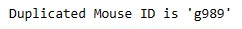

* Summary statistics table consisting of the mean, median, variance, standard deviation, and SEM of the tumor volume for each drug regimen.

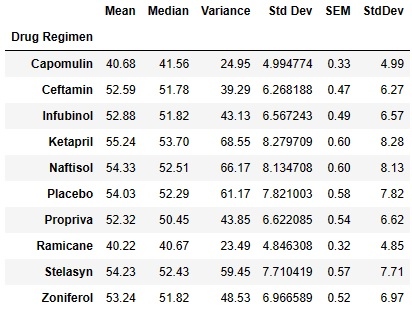

* Bar plot showing the total number of timepoints for all mice tested for each drug regimen throughout the course of the study.

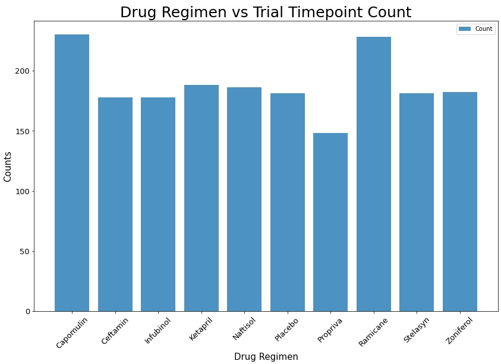

* Pie plot showing distribution of female or male mice in the study.

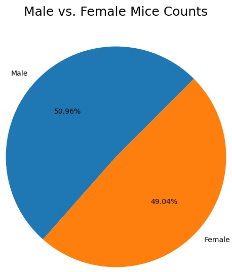

* The following are the final tumor volumes of each mouse across four of the most promising treatment regimens: Capomulin, Ramicane, Infubinol, and Ceftamin with IQR caculations to identify potential outliers across all four treatment regimens.

### Capomulin

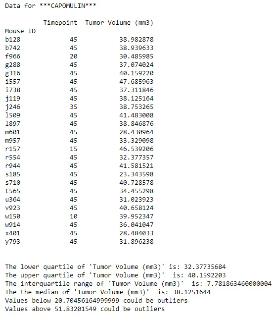

### Ramicane

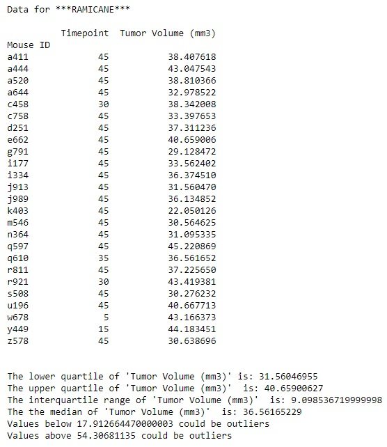

### Infubinol

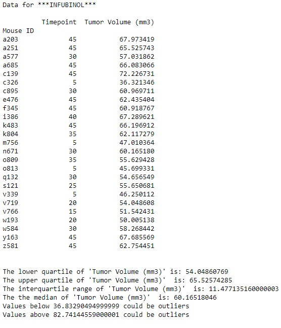

### Ceftamin

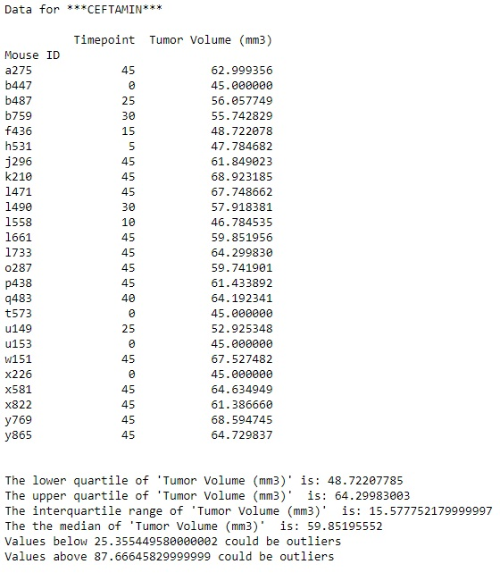

* Box and whisker plot of the final tumor volume for all four treatment regimens and highlight any potential outliers in the plot by changing their color and style.

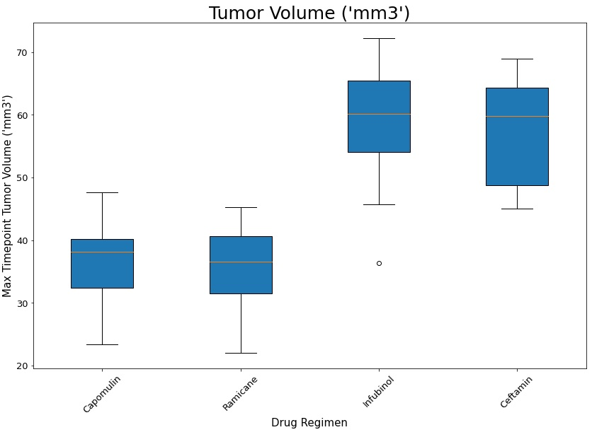

* Line plot of tumor volume vs. time point for non-specific test subject

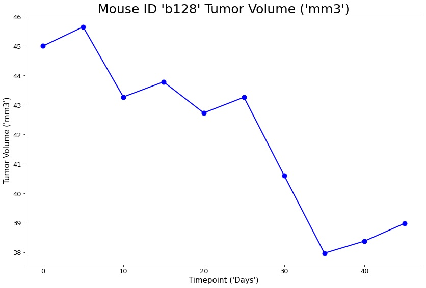

* Scatter plot of tumor volume versus mouse weight for the Capomulin treatment regimen

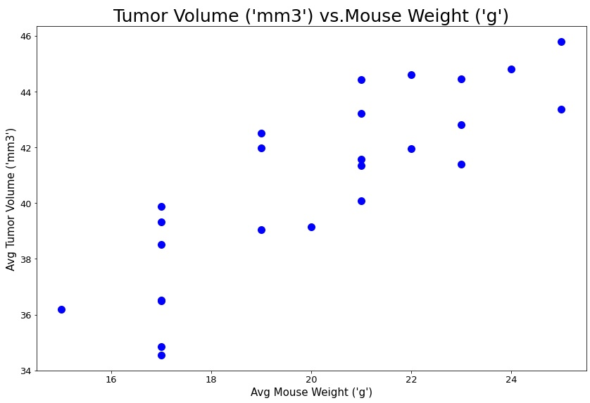

* Correlation coefficient and linear regression model between mouse weight and average tumor volume for the Capomulin treatment. 

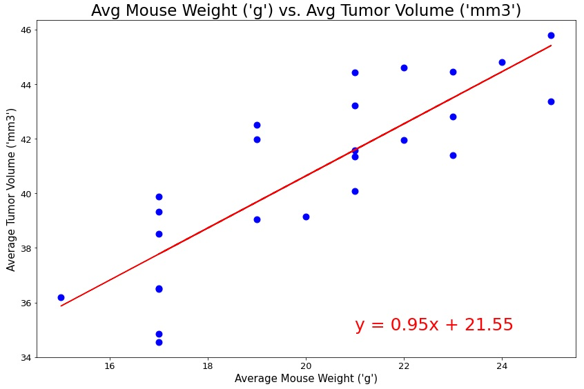
